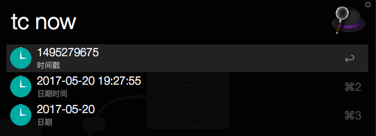

Alfred-codezm-workflows-timestamp-convert
=========================================

## 时间戳转换工具
默认快捷键`tc`，查看转换结果。

### 效果

### 下载

[点击下载](https://github.com/codezm/Alfred-codezm-workflows-timestamp-convert/releases/download/v2.0.0/Alfred-codezm-workflows-timestamp-convert.alfredworkflow)

### 安装

下载后直接双击导入即可.

### 使用

- 展示当天时间信息 `tc n` 或者 `tc now` 
- 当然您也可以使用 `tc tomorrow` `tc yesterday`
- 将时间戳转换成日期格式, 反之亦然 `tc 1495276608` `tc 2017-05-20 18:52:46`
- 选中某一项转换结果键入 `Enter` 即可复制, `Shift + Enter` 将发音.
